# Authentication Flow

This document details the authentication and authorization flows in the 2FA Authentication Service.

## User Registration


### Registration Request

```json
POST /auth/register
{
  "email": "user@example.com",
  "username": "johndoe",
  "password": "SecureP@ssw0rd123!"
}
```

### Registration Response

```json
{
  "success": true,
  "data": {
    "accessToken": "eyJhbGciOiJIUzI1NiIs...",
    "refreshToken": "eyJhbGciOiJIUzI1NiIs...",
    "user": {
      "id": "uuid",
      "email": "user@example.com",
      "username": "johndoe",
      "twoFactorEnabled": false,
      "createdAt": "2024-10-19T00:00:00.000Z"
    }
  }
}
```

## Login Without 2FA


## Login With 2FA (TOTP)

```mermaid
%%{init: {'theme':'base', 'themeVariables': { 'primaryColor':'#667eea','primaryTextColor':'#fff','primaryBorderColor':'#764ba2','lineColor':'#764ba2','secondaryColor':'#84fab0','tertiaryColor':'#fa709a'}}}%%
sequenceDiagram
    participant Client
    participant API
    participant AuthSvc as Auth Service
    participant TFASvc as 2FA Service
    participant Worker as Argon2 Worker
    participant DB as PostgreSQL
    participant Redis
    participant Audit as Audit Service

    rect rgb(230, 235, 250)
    Note over Client,Audit: 🔐 Step 1: Initial Authentication
    Client->>+API: POST /auth/login<br/>{email, password}
    API->>+AuthSvc: Authenticate
    AuthSvc->>+DB: Query user
    DB-->>-AuthSvc: User data
    AuthSvc->>+Worker: Verify password (Argon2)
    Worker-->>-AuthSvc: ✓ Valid

    AuthSvc->>+DB: Check 2FA enabled
    DB-->>-AuthSvc: ✓ TOTP enabled

    AuthSvc->>+Redis: Store temp token (5 min TTL)
    Redis-->>-AuthSvc: Token stored
    AuthSvc-->>-API: Return temp token
    API-->>-Client: 200 OK<br/>{tempToken, requires2FA: true, method: "totp"}
    end

    rect rgb(230, 250, 235)
    Note over Client,Audit: 📱 Step 2: Client Prompts for TOTP Code
    Client->>Client: Show TOTP input
    Note over Client: User opens Google Authenticator<br/>and enters 6-digit code
    end

    rect rgb(250, 235, 230)
    Note over Client,Audit: ✅ Step 3: 2FA Verification
    Client->>+API: POST /2fa/verify<br/>{tempToken, code: "123456"}
    API->>+TFASvc: Verify TOTP code
    TFASvc->>+DB: Get user's TOTP secret
    DB-->>-TFASvc: Secret key
    TFASvc->>TFASvc: Generate expected codes<br/>(with time drift tolerance)

    alt Code valid
        TFASvc->>+AuthSvc: Generate JWT tokens
        AuthSvc->>+DB: Store refresh token
        DB-->>-AuthSvc: Token stored
        AuthSvc->>+Redis: Store session
        Redis-->>-AuthSvc: Session stored
        AuthSvc->>Audit: Log 2FA success ✓
        AuthSvc-->>-TFASvc: Tokens generated
        TFASvc-->>-API: Return tokens
        API-->>-Client: 200 OK<br/>{accessToken, refreshToken}
    else Code invalid
        TFASvc->>Audit: Log 2FA failure ✗
        TFASvc-->>API: Invalid code
        API-->>Client: 401 Unauthorized
    end
    end
```



## Login With 2FA (SMS/Email)


## Token Refresh


## Logout


## 2FA Setup (TOTP)


## Trusted Device Flow


## API Key Authentication


## Token Types and Lifetimes

| Token Type | Purpose | Lifetime | Storage |
|------------|---------|----------|---------|
| **Access Token** | API authorization | 15 minutes | Client memory |
| **Refresh Token** | Obtain new access token | 7 days | Database + Client storage |
| **Temp Token** | Hold 2FA session | 5 minutes | Redis only |
| **Device Token** | Trust device for 2FA | 30 days | Database + Client storage |
| **API Key** | Third-party integration | Until revoked | Database |

## Security Features

### Password Requirements

- Minimum 8 characters
- At least one uppercase letter
- At least one lowercase letter
- At least one number
- At least one special character

### Rate Limiting

| Endpoint | Limit |
|----------|-------|
| `/auth/register` | 5 requests / 15 minutes |
| `/auth/login` | 5 requests / 15 minutes |
| `/2fa/verify` | 10 requests / 15 minutes |
| `/auth/refresh` | 10 requests / 15 minutes |
| Other endpoints | 100 requests / 15 minutes |

### Password Hashing

- **Algorithm**: Argon2id
- **Memory**: 64MB
- **Iterations**: 3
- **Parallelism**: 4
- **Worker Pool**: Piscina (prevents event loop blocking)

### JWT Security

- **Algorithm**: HS256 (HMAC with SHA-256)
- **Secrets**: Minimum 64 characters, cryptographically random
- **Rotation**: Refresh tokens rotated on each refresh
- **Revocation**: Refresh tokens stored in database for revocation

## Error Responses

### Invalid Credentials

```json
{
  "success": false,
  "error": "Invalid email or password"
}
```

### 2FA Required

```json
{
  "success": true,
  "data": {
    "tempToken": "eyJhbGciOiJIUzI1NiIs...",
    "requires2FA": true,
    "availableMethods": ["totp", "sms", "email"]
  }
}
```

### Invalid 2FA Code

```json
{
  "success": false,
  "error": "Invalid verification code"
}
```

### Rate Limit Exceeded

```json
{
  "success": false,
  "error": "Too many requests. Please try again later."
}
```

## Next Steps

- [Database Schema](database-schema.md) - Data model and relationships
- [Security Architecture](security.md) - Security controls
- [API Reference](../api/authentication.md) - Detailed endpoint documentation
