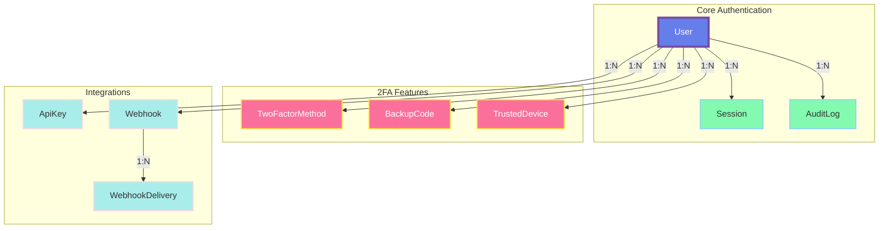

# Database Schema

## Overview

The database consists of 9 core entities organized around user authentication, 2FA methods, session management, and integrations.

### High-Level Entity Relationships



### Detailed Entity Relationships

!!! tip "Organized by Feature"
    Click the tabs below to view different entity groups. Each diagram shows only related entities for better readability.

=== "Core Authentication"

    ```mermaid
    erDiagram
        User ||--o{ Session : "has"
        User ||--o{ AuditLog : "creates"

        User {
            uuid id PK
            string email UK
            string username UK
            string passwordHash
            boolean twoFactorEnabled
            boolean isActive
        }

        Session {
            uuid id PK
            uuid userId FK
            string refreshToken UK
            string ipAddress
            timestamp expiresAt
            timestamp lastUsedAt
        }

        AuditLog {
            uuid id PK
            uuid userId FK
            string action
            string ipAddress
            boolean success
            timestamp createdAt
        }
    ```

=== "2FA Features"

    ```mermaid
    erDiagram
        User ||--o{ TwoFactorMethod : "has"
        User ||--o{ BackupCode : "has"
        User ||--o{ TrustedDevice : "has"

        User {
            uuid id PK
            string email UK
            string username UK
            boolean twoFactorEnabled
        }

        TwoFactorMethod {
            uuid id PK
            uuid userId FK
            string type
            boolean enabled
            string secret
            timestamp verifiedAt
        }

        BackupCode {
            uuid id PK
            uuid userId FK
            string codeHash
            timestamp usedAt
            timestamp createdAt
        }

        TrustedDevice {
            uuid id PK
            uuid userId FK
            string deviceToken UK
            string deviceName
            timestamp expiresAt
            timestamp lastUsedAt
        }
    ```

=== "Integrations"

    ```mermaid
    erDiagram
        User ||--o{ ApiKey : "owns"
        User ||--o{ Webhook : "owns"
        Webhook ||--o{ WebhookDelivery : "has"

        User {
            uuid id PK
            string email UK
            string username UK
        }

        ApiKey {
            uuid id PK
            uuid userId FK
            string name
            string keyHash UK
            string[] scopes
            boolean isActive
            int rateLimit
        }

        Webhook {
            uuid id PK
            uuid userId FK
            string url
            string[] events
            boolean isActive
            int failureCount
        }

        WebhookDelivery {
            uuid id PK
            uuid webhookId FK
            string event
            int statusCode
            boolean success
            timestamp deliveredAt
        }
    ```

!!! info "Complete Column Definitions"
    The diagrams above show key columns. See the [Tables](#tables) section below for all columns and constraints.

## Tables

### User

Central user entity. All authentication and 2FA settings are linked to a user.

| Column | Type | Constraints | Description |
|--------|------|-------------|-------------|
| `id` | UUID | Primary Key | Unique user identifier |
| `email` | String | Unique, Not Null | User's email address |
| `username` | String | Unique, Not Null | Username for display |
| `passwordHash` | String | Not Null | Argon2id hashed password |
| `emailVerified` | Boolean | Default: false | Email verification status |
| `twoFactorEnabled` | Boolean | Default: false | Whether user has any 2FA enabled |
| `isActive` | Boolean | Default: true | Account status (for soft delete) |
| `createdAt` | Timestamp | Default: now() | Account creation time |
| `updatedAt` | Timestamp | Auto-update | Last profile update time |

**Relationships:**
- Has many `TwoFactorMethod`
- Has many `BackupCode`
- Has many `TrustedDevice`
- Has many `Session`
- Has many `AuditLog`
- Has many `ApiKey`
- Has many `Webhook`

**Indexes:**
- Primary: `id`
- Unique: `email`
- Unique: `username`

### TwoFactorMethod

Stores 2FA configuration per user. Each user can have multiple 2FA methods enabled.

| Column | Type | Constraints | Description |
|--------|------|-------------|-------------|
| `id` | UUID | Primary Key | Method identifier |
| `userId` | UUID | Foreign Key, Not Null | References `User.id` |
| `type` | String | Not Null | Method type: "totp", "sms", "email" |
| `enabled` | Boolean | Default: true | Whether method is active |
| `secret` | String | Nullable | TOTP secret (encrypted) |
| `phoneNumber` | String | Nullable | Phone for SMS 2FA |
| `email` | String | Nullable | Email for Email 2FA |
| `verifiedAt` | Timestamp | Nullable | When method was verified |
| `createdAt` | Timestamp | Default: now() | Creation time |
| `updatedAt` | Timestamp | Auto-update | Last update time |

**Relationships:**
- Belongs to `User`

**Indexes:**
- Primary: `id`
- Unique: `(userId, type)` - Prevents duplicate method types per user

**Constraints:**
- `ON DELETE CASCADE` - Delete methods when user is deleted

### BackupCode

One-time use backup codes for account recovery when primary 2FA is unavailable.

| Column | Type | Constraints | Description |
|--------|------|-------------|-------------|
| `id` | UUID | Primary Key | Code identifier |
| `userId` | UUID | Foreign Key, Not Null | References `User.id` |
| `codeHash` | String | Not Null | Hashed backup code (bcrypt) |
| `usedAt` | Timestamp | Nullable | When code was used (NULL = unused) |
| `createdAt` | Timestamp | Default: now() | Creation time |

**Relationships:**
- Belongs to `User`

**Indexes:**
- Primary: `id`
- Index: `userId`

**Constraints:**
- `ON DELETE CASCADE` - Delete codes when user is deleted

**Notes:**
- Codes are generated in sets of 10
- Each code can only be used once
- Codes are hashed for security

### TrustedDevice

Devices that have been marked as trusted, allowing 2FA bypass for 30 days.

| Column | Type | Constraints | Description |
|--------|------|-------------|-------------|
| `id` | UUID | Primary Key | Device identifier |
| `userId` | UUID | Foreign Key, Not Null | References `User.id` |
| `deviceToken` | String | Unique, Not Null | JWT device token |
| `deviceName` | String | Nullable | User-friendly name (e.g., "iPhone 13") |
| `ipAddress` | String | Not Null | IP when device was trusted |
| `userAgent` | String | Not Null | Browser/device info |
| `expiresAt` | Timestamp | Not Null | When trust expires (30 days) |
| `createdAt` | Timestamp | Default: now() | When device was trusted |
| `lastUsedAt` | Timestamp | Default: now() | Last login from device |

**Relationships:**
- Belongs to `User`

**Indexes:**
- Primary: `id`
- Unique: `deviceToken`
- Index: `userId`
- Index: `expiresAt` - For cleanup queries

**Constraints:**
- `ON DELETE CASCADE` - Delete devices when user is deleted

### Session

Active user sessions linked to refresh tokens.

| Column | Type | Constraints | Description |
|--------|------|-------------|-------------|
| `id` | UUID | Primary Key | Session identifier |
| `userId` | UUID | Foreign Key, Not Null | References `User.id` |
| `refreshToken` | String | Unique, Not Null | Hashed refresh token |
| `ipAddress` | String | Nullable | Login IP address |
| `userAgent` | String | Nullable | Browser/device info |
| `expiresAt` | Timestamp | Not Null | Session expiry (7 days) |
| `createdAt` | Timestamp | Default: now() | Session start time |
| `lastUsedAt` | Timestamp | Default: now() | Last token refresh |

**Relationships:**
- Belongs to `User`

**Indexes:**
- Primary: `id`
- Unique: `refreshToken`
- Index: `userId`
- Index: `expiresAt` - For cleanup queries

**Constraints:**
- `ON DELETE CASCADE` - Delete sessions when user is deleted

**Notes:**
- Supports session revocation ("logout all devices")
- Expired sessions cleaned up by background job

### AuditLog

Security event tracking for compliance and monitoring.

| Column | Type | Constraints | Description |
|--------|------|-------------|-------------|
| `id` | UUID | Primary Key | Log entry identifier |
| `userId` | UUID | Foreign Key, Nullable | References `User.id` (NULL for system events) |
| `action` | String | Not Null | Event type (e.g., "login", "2fa_enabled") |
| `details` | String | Nullable | JSON string with additional context |
| `ipAddress` | String | Nullable | IP where event occurred |
| `userAgent` | String | Nullable | Browser/device info |
| `success` | Boolean | Default: true | Whether action succeeded |
| `createdAt` | Timestamp | Default: now() | Event timestamp |

**Relationships:**
- Belongs to `User` (optional)

**Indexes:**
- Primary: `id`
- Index: `userId`
- Index: `action` - For event type queries
- Index: `createdAt` - For time-based queries

**Constraints:**
- `ON DELETE SET NULL` - Keep audit logs even if user is deleted

**Common Actions:**
- `user_registered`
- `user_login`
- `user_logout`
- `2fa_enabled`
- `2fa_disabled`
- `2fa_verified`
- `2fa_failed`
- `password_reset_requested`
- `password_reset_completed`
- `api_key_created`
- `api_key_revoked`

### ApiKey

API keys for third-party integration and programmatic access.

| Column | Type | Constraints | Description |
|--------|------|-------------|-------------|
| `id` | UUID | Primary Key | Key identifier |
| `userId` | UUID | Foreign Key, Not Null | References `User.id` |
| `name` | String | Not Null | Human-readable name |
| `keyHash` | String | Unique, Not Null | Hashed API key (bcrypt) |
| `keyPrefix` | String | Not Null | First 8 chars for identification |
| `scopes` | String[] | Not Null | Permissions array |
| `expiresAt` | Timestamp | Nullable | Optional expiration |
| `lastUsedAt` | Timestamp | Nullable | Last API call with this key |
| `isActive` | Boolean | Default: true | Can be disabled without deletion |
| `rateLimit` | Int | Default: 1000 | Requests per hour |
| `createdAt` | Timestamp | Default: now() | Creation time |
| `updatedAt` | Timestamp | Auto-update | Last update time |

**Relationships:**
- Belongs to `User`

**Indexes:**
- Primary: `id`
- Unique: `keyHash`
- Index: `userId`
- Index: `isActive`

**Constraints:**
- `ON DELETE CASCADE` - Delete keys when user is deleted

**Scopes:**
- `2fa:read` - View 2FA status
- `2fa:write` - Enable/disable 2FA
- `webhooks:read` - View webhooks
- `webhooks:write` - Create/update webhooks
- `user:read` - View user profile
- `user:write` - Update user profile

### Webhook

Webhook endpoints for real-time event notifications.

| Column | Type | Constraints | Description |
|--------|------|-------------|-------------|
| `id` | UUID | Primary Key | Webhook identifier |
| `userId` | UUID | Foreign Key, Not Null | References `User.id` |
| `url` | String | Not Null | Webhook endpoint URL |
| `events` | String[] | Not Null | Subscribed events |
| `secret` | String | Not Null | HMAC secret for signature |
| `isActive` | Boolean | Default: true | Can be disabled |
| `failureCount` | Int | Default: 0 | Consecutive failures |
| `lastSuccess` | Timestamp | Nullable | Last successful delivery |
| `lastFailure` | Timestamp | Nullable | Last failed delivery |
| `createdAt` | Timestamp | Default: now() | Creation time |
| `updatedAt` | Timestamp | Auto-update | Last update time |

**Relationships:**
- Belongs to `User`
- Has many `WebhookDelivery`

**Indexes:**
- Primary: `id`
- Index: `userId`
- Index: `isActive`

**Constraints:**
- `ON DELETE CASCADE` - Delete webhooks when user is deleted

**Events:**
- `2fa.enabled` - User enabled 2FA
- `2fa.disabled` - User disabled 2FA
- `2fa.verified` - 2FA verification succeeded
- `2fa.failed` - 2FA verification failed
- `user.login` - User logged in
- `user.logout` - User logged out

**Notes:**
- Webhooks auto-disabled after 10 consecutive failures
- Deliveries retried with exponential backoff

### WebhookDelivery

Logs of webhook delivery attempts for debugging and monitoring.

| Column | Type | Constraints | Description |
|--------|------|-------------|-------------|
| `id` | UUID | Primary Key | Delivery identifier |
| `webhookId` | UUID | Foreign Key, Not Null | References `Webhook.id` |
| `event` | String | Not Null | Event type |
| `payload` | String | Not Null | JSON payload sent |
| `statusCode` | Int | Nullable | HTTP response code |
| `response` | String | Nullable | Response body |
| `attempt` | Int | Default: 1 | Retry attempt number |
| `success` | Boolean | Default: false | Delivery succeeded |
| `error` | String | Nullable | Error message if failed |
| `deliveredAt` | Timestamp | Default: now() | Attempt timestamp |

**Relationships:**
- Belongs to `Webhook`

**Indexes:**
- Primary: `id`
- Index: `webhookId`
- Index: `deliveredAt` - For cleanup queries

**Constraints:**
- `ON DELETE CASCADE` - Delete logs when webhook is deleted

**Notes:**
- Kept for 30 days (configurable)
- Used for debugging delivery issues

## Redis Data Structures

The following data is stored in Redis (not PostgreSQL) for performance and automatic expiration:

### OTP Codes

**Key:** `otp:{userId}:{type}` (e.g., `otp:uuid:sms`)

**Value:**
```json
{
  "code": "123456",
  "expiresAt": "2024-10-19T12:05:00Z",
  "attempts": 0
}
```

**TTL:** 5 minutes

### Rate Limiting

**Key:** `ratelimit:{endpoint}:{identifier}` (e.g., `ratelimit:/auth/login:192.168.1.1`)

**Value:** Request count

**TTL:** 15 minutes

### Session Cache

**Key:** `session:{sessionId}`

**Value:**
```json
{
  "userId": "uuid",
  "refreshToken": "hashed_token",
  "expiresAt": "2024-10-26T00:00:00Z"
}
```

**TTL:** 7 days

### Device Token Cache

**Key:** `device:{deviceToken}`

**Value:**
```json
{
  "userId": "uuid",
  "deviceId": "uuid",
  "expiresAt": "2024-11-18T00:00:00Z"
}
```

**TTL:** 30 days

## Migrations

Database migrations are managed by Prisma Migrate.

### Run Migrations

```bash
# Development
npx prisma migrate dev

# Production
npx prisma migrate deploy
```

### Create Migration

```bash
npx prisma migrate dev --name descriptive_name
```

### Reset Database

```bash
# WARNING: Deletes all data
npx prisma migrate reset
```

## Indexes and Performance

### Critical Indexes

| Table | Column(s) | Type | Purpose |
|-------|-----------|------|---------|
| User | email | Unique | Fast user lookup by email |
| User | username | Unique | Fast user lookup by username |
| TwoFactorMethod | (userId, type) | Unique | Prevent duplicate methods |
| Session | refreshToken | Unique | Fast session lookup |
| Session | expiresAt | Index | Cleanup expired sessions |
| TrustedDevice | deviceToken | Unique | Fast device lookup |
| TrustedDevice | expiresAt | Index | Cleanup expired devices |
| AuditLog | createdAt | Index | Time-based queries |
| AuditLog | action | Index | Filter by event type |
| ApiKey | keyHash | Unique | Fast API key validation |

### Query Optimization

- **Connection Pooling**: Prisma manages connection pool (max 10 connections)
- **Prepared Statements**: All queries use parameterized queries
- **Selective Loading**: Only load required fields/relations
- **Pagination**: Use cursor-based pagination for large result sets

## Data Retention

| Data Type | Retention Period | Cleanup Method |
|-----------|------------------|----------------|
| OTP Codes | 5 minutes | Redis TTL |
| Rate Limit Counters | 15 minutes | Redis TTL |
| Expired Sessions | 7 days + 1 day grace | Background job |
| Expired Devices | 30 days + 7 day grace | Background job |
| Audit Logs | 1 year | Background job (configurable) |
| Webhook Deliveries | 30 days | Background job |
| Used Backup Codes | Indefinite | Manual cleanup |

## Security Considerations

### Sensitive Data

| Field | Protection |
|-------|------------|
| `User.passwordHash` | Argon2id hashing |
| `TwoFactorMethod.secret` | Encrypted at application level |
| `BackupCode.codeHash` | Bcrypt hashing |
| `ApiKey.keyHash` | Bcrypt hashing |
| `Webhook.secret` | Encrypted at application level |

### Best Practices

- Never log sensitive fields (passwords, tokens, secrets)
- Use database-level encryption for `TwoFactorMethod.secret` and `Webhook.secret`
- Regularly rotate encryption keys
- Enable PostgreSQL audit logging in production
- Use read replicas for non-critical queries
- Enable SSL/TLS for database connections

## Next Steps

- [System Architecture](overview.md) - High-level architecture
- [Authentication Flow](authentication-flow.md) - Auth process details
- [Security Architecture](security.md) - Security controls
- [Deployment Guide](../deployment/docker.md) - Deploy to production
