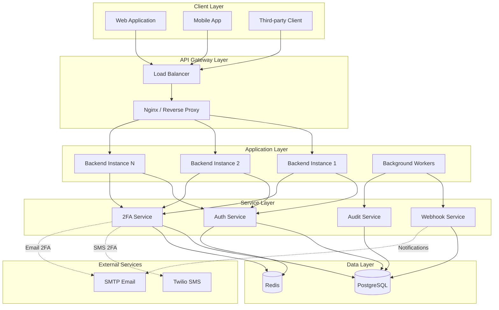
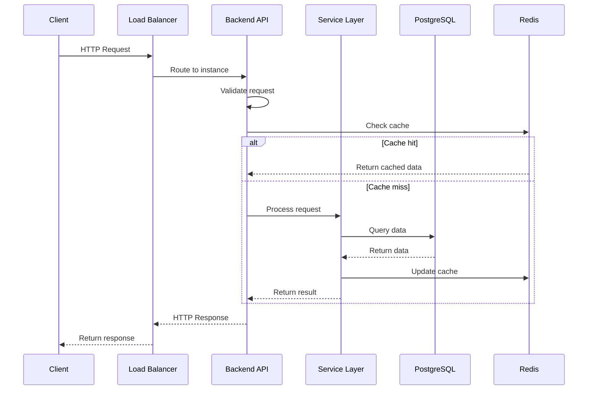
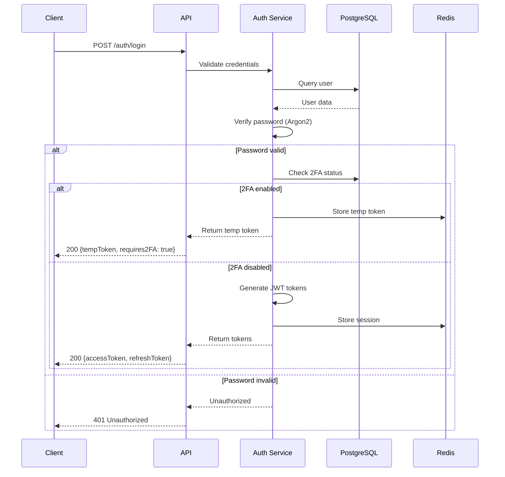
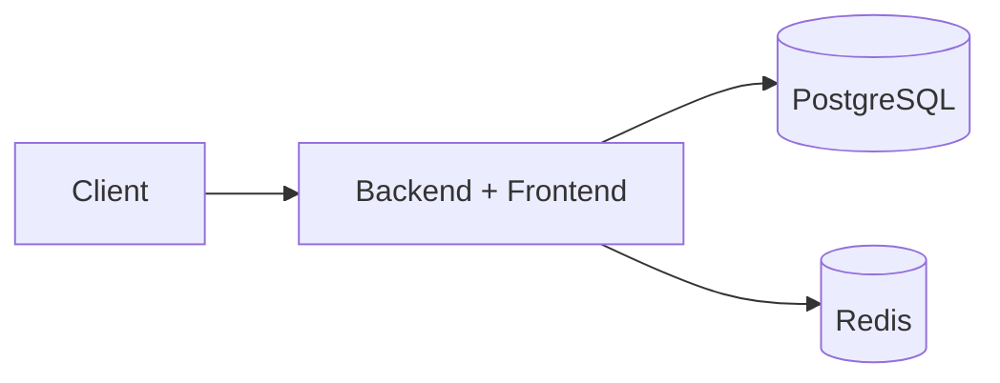
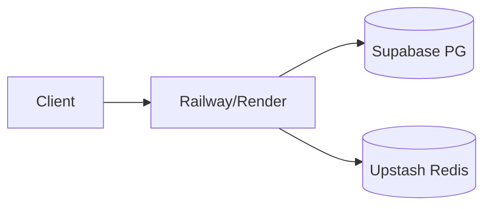
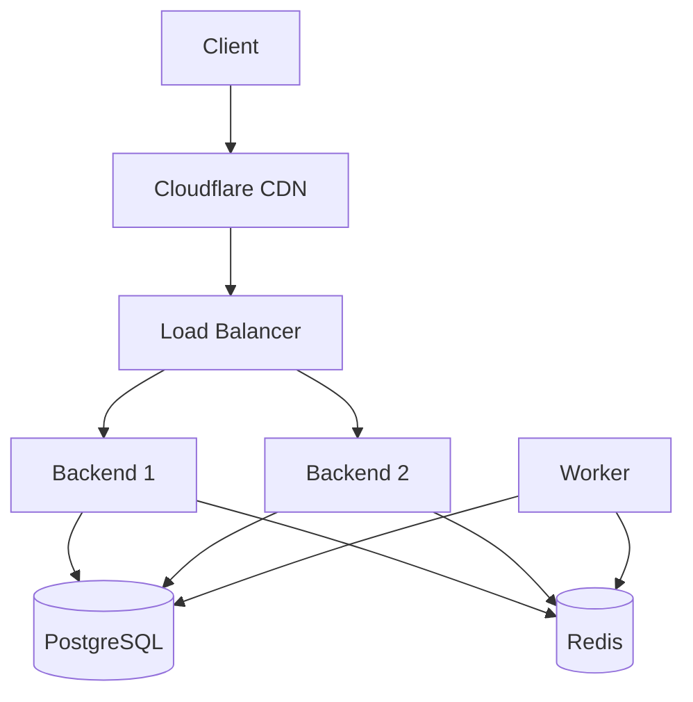
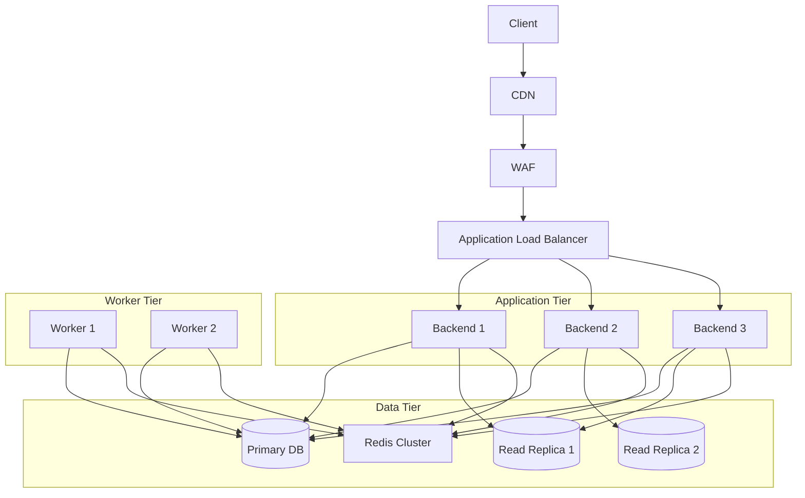
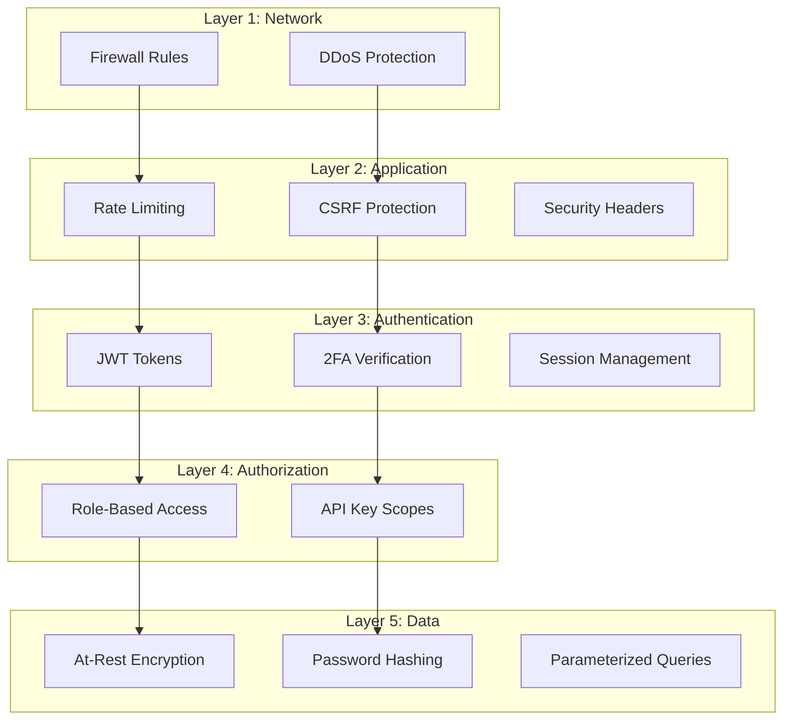

# System Architecture

## Overview

The 2FA Authentication Service is a production-ready microservice built on a modern, scalable architecture. It provides enterprise-grade two-factor authentication capabilities through a RESTful API.

## High-Level Architecture

## Component Breakdown

### 1. Client Layer

**Purpose**: Applications that consume the 2FA service

- **Web Applications**: Next.js frontend (included) or custom web apps
- **Mobile Apps**: iOS, Android, React Native, Flutter
- **Third-party Clients**: Services integrating via API keys

### 2. API Gateway Layer

**Purpose**: Traffic routing and load balancing

- **Load Balancer**: Distributes requests across backend instances
- **Reverse Proxy**: Nginx for SSL termination, static content, rate limiting
- **Features**:
  - SSL/TLS termination
  - Request routing
  - Static file serving
  - Compression

### 3. Application Layer

**Purpose**: Core business logic execution

#### Backend Instances
- Node.js/Express applications
- Horizontally scalable
- Stateless design (sessions in Redis)
- JWT-based authentication

#### Background Workers
- BullMQ job processors
- Handles async operations:
  - Webhook delivery
  - Email sending
  - Audit log processing
  - Cleanup tasks

### 4. Service Layer

**Purpose**: Domain-specific business logic

#### Authentication Service
- User registration and login
- Password hashing (Argon2id)
- JWT token management
- Session management

#### 2FA Service
- TOTP generation and verification
- SMS OTP delivery
- Email OTP delivery
- Backup code management
- Trusted device tracking

#### Webhook Service
- Event notification delivery
- HMAC signature generation
- Retry logic with exponential backoff
- Delivery tracking

#### Audit Service
- Security event logging
- User activity tracking
- Compliance monitoring

### 5. Data Layer

**Purpose**: Persistent and transient data storage

#### PostgreSQL
- Primary data store
- User accounts
- 2FA settings
- API keys
- Webhooks
- Audit logs
- Connection pooling via Prisma

#### Redis
- OTP code storage (temporary)
- Rate limiting counters
- Session storage
- Job queue (BullMQ)
- Cache layer

### 6. External Services

**Purpose**: Third-party integrations

- **Twilio**: SMS delivery for SMS 2FA
- **SMTP**: Email delivery for Email 2FA
- Optional: Can be disabled for TOTP-only deployments

## Data Flow

### Request Flow

### Authentication Flow

## Deployment Architectures

### Single Instance (Development)

**Use case**: Local development, testing

**Resources**: Docker Compose, 2GB RAM

### Free Tier (Zero Budget)

**Use case**: Small projects, POC, < 100 users

**Cost**: $0/month

**Limitations**:
- Single instance
- 500-750 hours/month
- 10MB Redis
- Cold starts

### Production (Small Scale)

**Use case**: Production apps, 1K-10K users

**Cost**: $25-50/month

**Features**:
- Multiple instances
- Auto-scaling
- High availability
- Monitoring

### Production (Enterprise)

**Use case**: Enterprise, 100K+ users

**Cost**: $500+/month

**Features**:
- Multi-region deployment
- Database replication
- Redis cluster
- WAF protection
- DDoS mitigation
- 99.9% SLA

## Technology Stack

### Backend
- **Runtime**: Node.js 18+
- **Framework**: Express.js
- **Language**: TypeScript
- **ORM**: Prisma
- **Validation**: Zod
- **Authentication**: JWT (jsonwebtoken)
- **Password Hashing**: Argon2id
- **Job Queue**: BullMQ

### Frontend
- **Framework**: Next.js 15
- **Language**: TypeScript
- **Styling**: Tailwind CSS
- **UI Components**: shadcn/ui
- **State**: React Context
- **HTTP Client**: Axios

### Infrastructure
- **Database**: PostgreSQL 14+
- **Cache**: Redis 6+
- **Container**: Docker
- **Orchestration**: Docker Compose / Kubernetes
- **CI/CD**: GitHub Actions

### External Services
- **SMS**: Twilio (optional)
- **Email**: SMTP / Nodemailer
- **Monitoring**: Custom health checks

## Security Architecture

### Defense in Depth

### Security Features

- **Password Security**: Argon2id with configurable memory, iterations, parallelism
- **JWT Security**: Short-lived access tokens (15 min), rotating refresh tokens
- **2FA Methods**: TOTP, SMS, Email, Backup codes, Trusted devices
- **Rate Limiting**: Per-endpoint limits, IP-based, user-based
- **CSRF Protection**: Double-submit cookie pattern
- **Security Headers**: Helmet.js (CSP, HSTS, X-Frame-Options)
- **Input Validation**: Zod schemas, sanitization
- **SQL Injection Prevention**: Prisma ORM with parameterized queries
- **Audit Logging**: All security events tracked

## Scalability

### Horizontal Scaling

The service is designed for horizontal scaling:

- **Stateless Design**: All state in PostgreSQL/Redis
- **Session Storage**: Redis-backed sessions
- **Load Balancing**: Round-robin, least connections
- **Auto-scaling**: Based on CPU, memory, request rate

### Performance Optimizations

- **Worker Pool**: Piscina for CPU-intensive operations (password hashing)
- **Connection Pooling**: Prisma connection pool
- **Caching**: Redis for frequently accessed data
- **Async Processing**: BullMQ for background jobs
- **Compression**: gzip/brotli for responses

### Resource Limits

| Deployment | Users | RPS | Database | Redis |
|------------|-------|-----|----------|-------|
| Free Tier | 100 | 10 | 500MB | 10MB |
| Small | 1,000 | 50 | 2GB | 100MB |
| Medium | 10,000 | 200 | 10GB | 1GB |
| Large | 100,000+ | 1,000+ | 100GB+ | 10GB+ |

## Monitoring & Observability

### Health Checks

- `/api/health` - Overall health
- `/api/health/live` - Liveness probe
- `/api/health/ready` - Readiness probe

### Metrics

- Request rate
- Response time (p50, p95, p99)
- Error rate
- Database query performance
- Redis hit/miss ratio
- Worker queue depth

### Logging

- Application logs (Winston)
- Audit logs (database)
- Access logs (Nginx)
- Error tracking

## Next Steps

- [Authentication Flow](authentication-flow.md) - Detailed authentication process
- [Database Schema](database-schema.md) - Data model and relationships
- [Security Architecture](security.md) - Security controls and best practices
- [Deployment Guide](../deployment/docker.md) - Deploy to production
