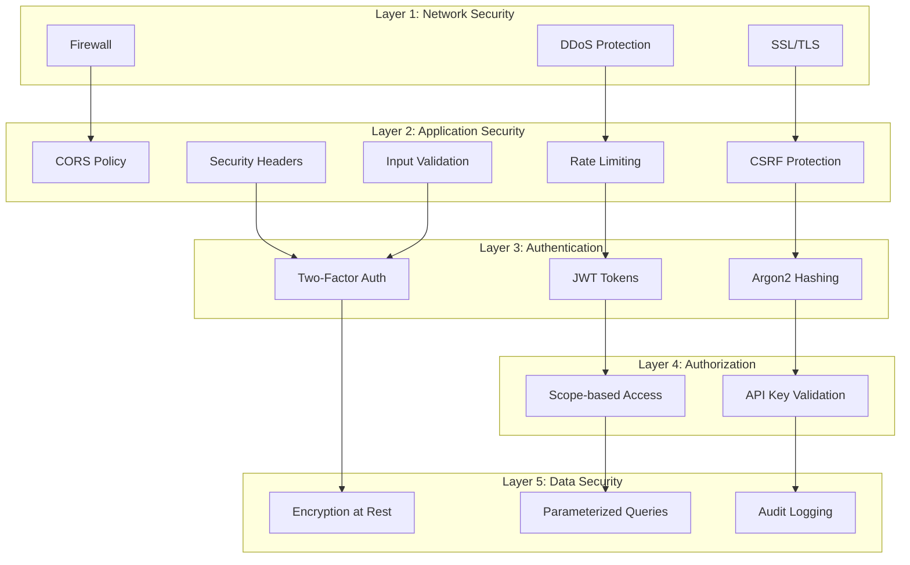
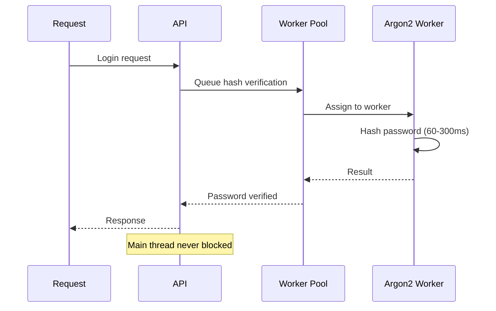
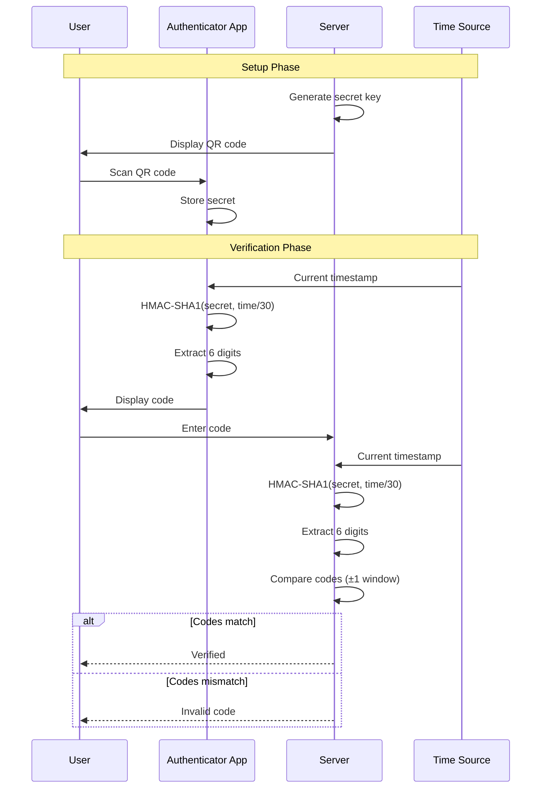
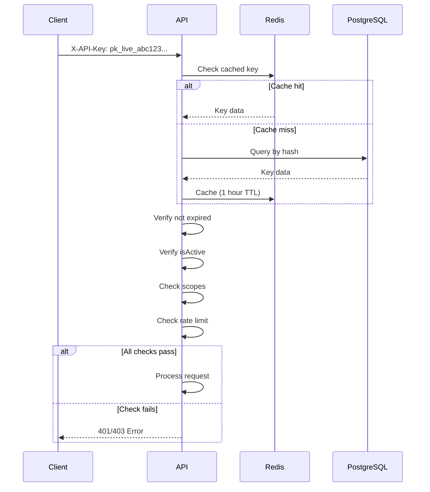
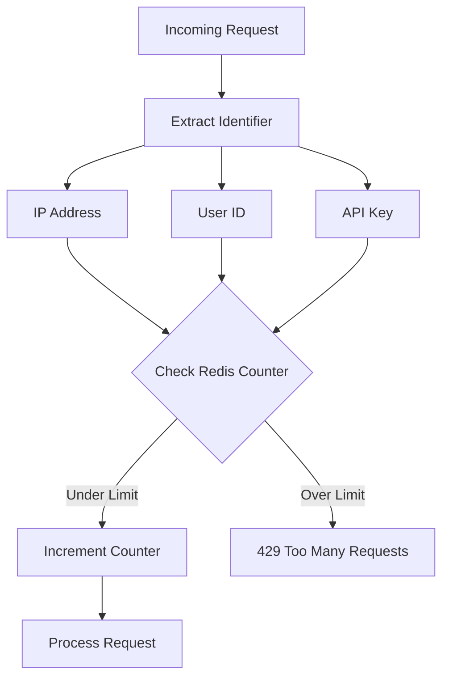
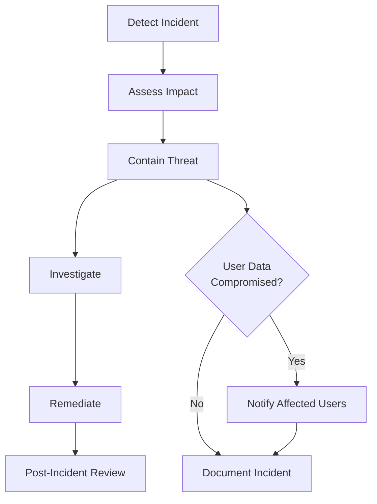

# Security Architecture

## Security Overview

The 2FA Authentication Service implements defense-in-depth security with multiple layers of protection:



## Authentication Security

### Password Security

#### Hashing Algorithm

**Argon2id** - Winner of the Password Hashing Competition (2015)

```javascript
// Configuration
{
  type: argon2.argon2id,
  memoryCost: 2 ** 16,  // 64 MB
  timeCost: 3,           // 3 iterations
  parallelism: 4         // 4 threads
}
```

**Why Argon2id?**
- Resistant to GPU cracking attacks (memory-hard)
- Resistant to side-channel attacks
- Configurable resource requirements
- More secure than bcrypt, scrypt, or PBKDF2

#### Worker Pool Pattern

Password hashing is CPU-intensive and can block the event loop:



**Benefits:**
- Main thread remains responsive
- Multiple requests processed in parallel
- CPU-intensive work isolated to worker threads

#### Password Requirements

- Minimum 8 characters
- At least one uppercase letter
- At least one lowercase letter
- At least one number
- At least one special character

**Validation:**
```regex
^(?=.*[a-z])(?=.*[A-Z])(?=.*\d)(?=.*[@$!%*?&])[A-Za-z\d@$!%*?&]{8,}$
```

### JWT Security

#### Token Types

| Token | Lifetime | Storage | Algorithm |
|-------|----------|---------|-----------|
| Access Token | 15 minutes | Client memory | HS256 |
| Refresh Token | 7 days | Database + HttpOnly cookie | HS256 |
| Temp Token | 5 minutes | Redis only | HS256 |
| Device Token | 30 days | Database + Client storage | HS256 |

#### Token Structure

**Access Token:**
```json
{
  "header": {
    "alg": "HS256",
    "typ": "JWT"
  },
  "payload": {
    "userId": "uuid",
    "email": "user@example.com",
    "iat": 1697654400,
    "exp": 1697655300
  }
}
```

**Refresh Token:**
```json
{
  "payload": {
    "userId": "uuid",
    "sessionId": "uuid",
    "tokenVersion": 1,
    "iat": 1697654400,
    "exp": 1698259200
  }
}
```

#### Secret Requirements

- Minimum 64 characters
- Cryptographically random (crypto.randomBytes)
- Different secrets for each token type
- Stored in environment variables (never in code)
- Rotated periodically

**Generation:**
```bash
node -e "console.log(require('crypto').randomBytes(64).toString('hex'))"
```

#### Token Revocation

**Refresh Tokens:**
- Stored in database
- Can be revoked individually or all at once
- Automatically cleaned up on expiration

**Access Tokens:**
- Cannot be revoked (short-lived by design)
- Compromise mitigated by 15-minute expiration

### Two-Factor Authentication

#### TOTP (Time-based One-Time Password)



**Security Features:**
- Secret stored encrypted in database
- 30-second time window
- ±1 window drift tolerance (prevents clock skew issues)
- Rate limiting (10 attempts per 15 minutes)
- No internet connection required

#### SMS 2FA

**Security Considerations:**
- Less secure than TOTP (vulnerable to SIM swapping)
- 6-digit random code
- 5-minute expiration
- Stored in Redis with TTL
- Rate limiting (5 SMS per hour)
- Recommended only as fallback

**Twilio Integration:**
- Verified sender numbers
- Message encryption in transit
- Delivery confirmation

#### Email 2FA

**Security Features:**
- 6-digit random code
- 5-minute expiration
- Stored in Redis with TTL
- Rate limiting (10 emails per hour)
- From address verification (SPF/DKIM)

#### Backup Codes

**Generation:**
- 10 codes per set
- 10-character alphanumeric
- Cryptographically random
- Hashed before storage (bcrypt)

**Usage:**
- Single-use only
- Marked as used (not deleted)
- Can regenerate new set
- Recommended to store offline

#### Trusted Devices

**Security:**
- 30-day JWT token
- Bound to IP + User-Agent
- Stored in database for revocation
- Can be removed individually or all
- Automatically expired

## Authorization Security

### Scope-based Access Control

API keys can have limited scopes:

```javascript
const scopes = [
  '2fa:read',      // View 2FA status
  '2fa:write',     // Enable/disable 2FA
  'webhooks:read', // View webhooks
  'webhooks:write',// Manage webhooks
  'user:read',     // View profile
  'user:write'     // Update profile
]
```

**Scope Validation:**
```javascript
// Middleware checks required scope
function requireScope(scope) {
  return (req, res, next) => {
    if (!req.apiKey.scopes.includes(scope)) {
      return res.status(403).json({ error: 'Insufficient permissions' })
    }
    next()
  }
}
```

### API Key Security

**Format:** `pk_live_<random_32_chars>`

**Storage:**
- Full key shown only once on creation
- Hashed before storage (bcrypt)
- Prefix stored for identification
- Last 4 characters shown in UI

**Validation Flow:**


## Network Security

### CORS (Cross-Origin Resource Sharing)

```javascript
{
  origin: process.env.CORS_ORIGINS?.split(',') || '*',
  credentials: true,
  methods: ['GET', 'POST', 'PUT', 'DELETE', 'OPTIONS'],
  allowedHeaders: ['Content-Type', 'Authorization', 'X-API-Key']
}
```

**Production Configuration:**
```env
CORS_ORIGINS=https://app.example.com,https://admin.example.com
```

### CSRF Protection

**Double-Submit Cookie Pattern:**

```javascript
// Generate CSRF token
const csrfToken = crypto.randomBytes(32).toString('hex')

// Set in cookie
res.cookie('csrf-token', csrfToken, {
  httpOnly: true,
  secure: true,
  sameSite: 'strict'
})

// Client must send in header
headers: {
  'X-CSRF-Token': csrfToken
}
```

**Protected Endpoints:**
- All state-changing operations (POST, PUT, DELETE)
- Login, registration, 2FA operations

### Rate Limiting



**Rate Limits:**

| Endpoint | Limit | Window |
|----------|-------|--------|
| `/auth/register` | 5 requests | 15 minutes |
| `/auth/login` | 5 requests | 15 minutes |
| `/2fa/verify` | 10 requests | 15 minutes |
| `/2fa/send-code` | 5 requests | 1 hour |
| Default | 100 requests | 15 minutes |

**Implementation:**
```javascript
// Redis-based sliding window
const key = `ratelimit:${endpoint}:${identifier}`
const count = await redis.incr(key)
if (count === 1) {
  await redis.expire(key, windowSeconds)
}
if (count > limit) {
  throw new TooManyRequestsError()
}
```

### Security Headers (Helmet.js)

```javascript
helmet({
  contentSecurityPolicy: {
    directives: {
      defaultSrc: ["'self'"],
      scriptSrc: ["'self'", "'unsafe-inline'"],
      styleSrc: ["'self'", "'unsafe-inline'"],
      imgSrc: ["'self'", 'data:', 'https:'],
    }
  },
  hsts: {
    maxAge: 31536000,
    includeSubDomains: true,
    preload: true
  },
  frameguard: { action: 'deny' },
  noSniff: true,
  xssFilter: true
})
```

**Headers Applied:**
- `Content-Security-Policy` - Prevent XSS
- `Strict-Transport-Security` - Enforce HTTPS
- `X-Frame-Options: DENY` - Prevent clickjacking
- `X-Content-Type-Options: nosniff` - Prevent MIME sniffing
- `X-XSS-Protection: 1; mode=block` - Browser XSS protection

## Data Security

### Input Validation

**Zod Schemas:**

```typescript
const registerSchema = z.object({
  email: z.string().email(),
  username: z.string().min(3).max(30).regex(/^[a-zA-Z0-9_]+$/),
  password: z.string().min(8).regex(passwordRegex)
})
```

**Validation Flow:**
1. Parse request body with Zod
2. Validate against schema
3. Sanitize inputs (trim, escape)
4. Type-safe usage in application

### SQL Injection Prevention

**Prisma ORM** - All queries are parameterized:

```typescript
// Safe - parameterized query
await prisma.user.findUnique({
  where: { email: userInput }
})

// Never do this - vulnerable to injection
await prisma.$executeRaw(`SELECT * FROM users WHERE email = '${userInput}'`)
```

### Encryption at Rest

**Sensitive Fields:**
- `TwoFactorMethod.secret` - TOTP secrets
- `Webhook.secret` - Webhook HMAC secrets

**Encryption:**
```javascript
const algorithm = 'aes-256-gcm'
const key = crypto.scryptSync(ENCRYPTION_KEY, 'salt', 32)

function encrypt(text) {
  const iv = crypto.randomBytes(16)
  const cipher = crypto.createCipheriv(algorithm, key, iv)
  const encrypted = Buffer.concat([cipher.update(text, 'utf8'), cipher.final()])
  const authTag = cipher.getAuthTag()
  return iv.toString('hex') + ':' + authTag.toString('hex') + ':' + encrypted.toString('hex')
}
```

### Audit Logging

**Logged Events:**
- All authentication attempts (success/failure)
- 2FA enable/disable/verify
- Password changes
- API key creation/revocation
- Webhook creation/modification
- Session creation/deletion

**Log Format:**
```json
{
  "id": "uuid",
  "userId": "uuid",
  "action": "2fa_enabled",
  "details": {
    "method": "totp",
    "backupCodesGenerated": 10
  },
  "ipAddress": "192.168.1.1",
  "userAgent": "Mozilla/5.0...",
  "success": true,
  "createdAt": "2024-10-19T12:00:00Z"
}
```

**Retention:** 1 year (configurable)

## Webhook Security

### HMAC Signatures

Every webhook request includes an HMAC signature:

```javascript
const signature = crypto
  .createHmac('sha256', webhookSecret)
  .update(JSON.stringify(payload))
  .digest('hex')

headers: {
  'X-Webhook-Signature': `sha256=${signature}`
}
```

**Verification:**
```javascript
function verifyWebhook(payload, signature, secret) {
  const expected = crypto
    .createHmac('sha256', secret)
    .update(JSON.stringify(payload))
    .digest('hex')

  return crypto.timingSafeEqual(
    Buffer.from(signature),
    Buffer.from(expected)
  )
}
```

### Webhook Security Best Practices

- Always verify HMAC signature
- Use HTTPS endpoints only
- Implement idempotency (webhook may be retried)
- Rate limit incoming webhooks
- Timeout requests after 5 seconds

## Compliance & Best Practices

### OWASP Top 10 Protection

| Risk | Mitigation |
|------|------------|
| **A01: Broken Access Control** | JWT validation, scope-based authorization |
| **A02: Cryptographic Failures** | Argon2id, AES-256-GCM, TLS 1.2+ |
| **A03: Injection** | Parameterized queries, input validation |
| **A04: Insecure Design** | 2FA, rate limiting, audit logging |
| **A05: Security Misconfiguration** | Security headers, CORS, environment-based config |
| **A06: Vulnerable Components** | Automated dependency scanning, regular updates |
| **A07: Authentication Failures** | Strong password policy, 2FA, account lockout |
| **A08: Software and Data Integrity** | Webhook signatures, npm audit, SRI |
| **A09: Security Logging Failures** | Comprehensive audit logging, monitoring |
| **A10: Server-Side Request Forgery** | URL validation, webhook allowlist |

### Security Checklist

**Development:**
- [ ] No secrets in code or version control
- [ ] All dependencies up to date
- [ ] npm audit passing
- [ ] All tests passing
- [ ] Code review completed

**Deployment:**
- [ ] SSL/TLS enabled (HTTPS only)
- [ ] Strong JWT secrets (64+ chars)
- [ ] CORS configured for production domains
- [ ] Rate limiting enabled
- [ ] Database backups automated
- [ ] Audit logging enabled
- [ ] Monitoring and alerting configured

**Ongoing:**
- [ ] Regular dependency updates
- [ ] Security patch deployment
- [ ] Audit log review
- [ ] Penetration testing
- [ ] Incident response plan

## Incident Response

### Security Incident Workflow



### Emergency Actions

**Suspected Token Compromise:**
```bash
# Revoke all refresh tokens for user
DELETE FROM sessions WHERE user_id = '<user_id>';

# Rotate JWT secrets (invalidates all access tokens)
# Update environment variables and restart service
```

**Suspected Database Breach:**
```bash
# Force password reset for all users
UPDATE users SET password_hash = NULL, is_active = false;

# Notify all users
# Send password reset emails
```

**DDoS Attack:**
```bash
# Enable aggressive rate limiting
# Block offending IP ranges at firewall level
# Enable Cloudflare DDoS protection
```

## Security Contacts

- **Security Issues:** security@example.com
- **Bug Reports:** https://github.com/Ilia01/Aegis2FA/issues
- **Security Policy:** https://github.com/Ilia01/Aegis2FA/security/policy

## Next Steps

- [System Architecture](overview.md) - High-level architecture
- [Authentication Flow](authentication-flow.md) - Auth process details
- [Database Schema](database-schema.md) - Data model
- [Deployment Guide](../deployment/docker.md) - Secure deployment
