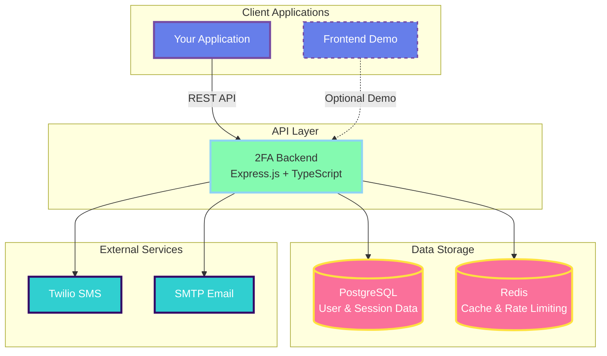

# 2FA Authentication Service

[](https://github.com/Ilia01/Aegis2FA/actions/workflows/backend-ci.yml)
[](https://github.com/Ilia01/Aegis2FA/actions/workflows/frontend-ci.yml)
[](https://github.com/Ilia01/Aegis2FA/actions/workflows/security.yml)
[](https://github.com/Ilia01/Aegis2FA/blob/main/LICENSE)

!!! success "Deploy with $0/month"
    Use TOTP 2FA (Google Authenticator) with absolutely no external services required!

## What is this?

A **production-ready Two-Factor Authentication service** that you can integrate into your applications. Provides enterprise-grade 2FA capabilities via REST API with a showcase frontend for testing.

### Key Features

- **Multiple 2FA Methods**: TOTP, SMS, Email, Backup Codes
- **Trusted Devices**: Skip 2FA on trusted devices for 30 days
- **API Key Management**: Secure third-party integration
- **Webhook Support**: Real-time event notifications
- **Zero-Budget Option**: Deploy for free with TOTP only
- **Full Test Coverage**: 80%+ test coverage with comprehensive test suite

## Quick Links

<div class="grid cards" markdown>

-   :material-rocket-launch:{ .lg .middle } __Getting Started__

    ---

    Get up and running in 5 minutes

    [:octicons-arrow-right-24: Quick Start](getting-started/quick-start.md)

-   :material-api:{ .lg .middle } __API Reference__

    ---

    Interactive API documentation with Swagger UI

    [:octicons-arrow-right-24: Explore API](api/index.md)

-   :material-cloud-upload:{ .lg .middle } __Deployment__

    ---

    Deploy to production or cloud platforms

    [:octicons-arrow-right-24: Deployment Guide](deployment/docker.md)

-   :material-book-open-variant:{ .lg .middle } __Integration Guide__

    ---

    Learn how to integrate into your app

    [:octicons-arrow-right-24: Integration](guides/integration.md)

</div>

## Supported 2FA Methods

=== "TOTP"

    Time-based One-Time Password using Google Authenticator, Authy, or any TOTP app.

    **Cost**: Free (no external services)

    **Setup Time**: < 1 minute

    [:octicons-arrow-right-24: TOTP Setup Guide](api/two-factor.md#totp-time-based-one-time-password)

=== "SMS"

    Send verification codes via SMS using Twilio.

    **Cost**: Twilio charges apply

    **Setup Time**: 5-10 minutes

    [:octicons-arrow-right-24: SMS Setup Guide](api/two-factor.md#sms-2fa)

=== "Email"

    Send verification codes via email using any SMTP provider.

    **Cost**: Free (Gmail: 500 emails/day)

    **Setup Time**: 5 minutes

    [:octicons-arrow-right-24: Email Setup Guide](api/two-factor.md#email-2fa)

=== "Backup Codes"

    One-time use recovery codes for account recovery.

    **Cost**: Free

    **Included**: Auto-generated on 2FA setup

    [:octicons-arrow-right-24: Learn More](api/two-factor.md#backup-codes)

## Architecture Overview



**Backend**: Express.js + TypeScript + Prisma + Redis
**Frontend**: Next.js 15 + Tailwind CSS
**Database**: PostgreSQL + Redis
**Security**: Argon2 hashing, JWT tokens, rate limiting

[:octicons-arrow-right-24: Detailed Architecture](architecture/overview.md)

## Integration Approaches

### Option 1: Direct API Integration (Recommended)

Integrate the 2FA service into your existing application by calling the REST API endpoints.

```bash
# Start 2FA service
docker-compose up -d

# Call from your app
curl -X POST http://localhost:3001/api/auth/register \
  -H "Content-Type: application/json" \
  -d '{"email":"user@example.com","username":"user","password":"SecurePass123!"}'
```

[:octicons-arrow-right-24: API Integration Guide](guides/integration.md)

### Option 2: SDK Integration (Coming Soon)

Use our SDK to simplify integration (roadmap Phase 8).

```javascript
import { TwoFactorAuth } from '@Ilia01/2fa-sdk';

const tfa = new TwoFactorAuth({ apiUrl: 'http://localhost:3001/api' });
await tfa.setupTOTP(userId);
```

## Tech Stack

<div class="grid" markdown>

=== "Backend"

    - Node.js 18+
    - Express.js
    - TypeScript
    - PostgreSQL 14+ (Prisma ORM)
    - Redis 6+
    - Argon2 password hashing
    - Speakeasy (TOTP)
    - Twilio (SMS)
    - Nodemailer (Email)

=== "Frontend"

    - Next.js 15 (App Router with Turbopack)
    - TypeScript
    - Tailwind CSS
    - shadcn/ui Components
    - Axios with interceptors
    - QR code generation

=== "DevOps"

    - Docker & Docker Compose
    - GitHub Actions CI/CD
    - Security scanning (CodeQL, Trivy, TruffleHog)
    - Automated testing
    - Health checks
    - Monitoring ready

</div>

## Project Status

- [x] **Phase 1-4**: Backend API Service (User auth, TOTP, SMS, Email, Backup codes)
- [x] **Phase 5**: Showcase Frontend (Next.js with dark theme, 2FA wizard)
- [x] **Phase 6**: Service Enhancements (API keys, webhooks, health checks, Docker)
- [ ] **Phase 7**: Admin Dashboard (User management, audit logs, analytics)
- [ ] **Phase 8**: Client SDK (NPM package, React hooks, Python client)

[:octicons-arrow-right-24: Full Roadmap](changelog.md)

## Security

This service implements industry-standard security practices:

- ✅ Argon2id password hashing
- ✅ JWT authentication with refresh tokens
- ✅ Rate limiting on all sensitive endpoints
- ✅ CSRF protection
- ✅ Helmet security headers
- ✅ Input validation and sanitization
- ✅ SQL injection prevention (parameterized queries)
- ✅ Audit logging for security events

!!! warning "Security Disclosure"
    Found a security vulnerability? Please report it via [GitHub Security Advisories](https://github.com/Ilia01/Aegis2FA/security/advisories/new) instead of opening a public issue.

## Community & Support

- **Documentation**: You're reading it!
- **Issues**: [GitHub Issues](https://github.com/Ilia01/Aegis2FA/issues)
- **Discussions**: [GitHub Discussions](https://github.com/Ilia01/Aegis2FA/discussions)
- **Contributing**: [Contributing Guide](development/contributing.md)

## License

This project is licensed under the MIT License - see the [LICENSE](https://github.com/Ilia01/Aegis2FA/blob/main/LICENSE) file for details.

---

<div align="center">

**Ready to get started?**

[Quick Start](getting-started/quick-start.md){ .md-button .md-button--primary }
[View on GitHub](https://github.com/Ilia01/Aegis2FA){ .md-button }

</div>
